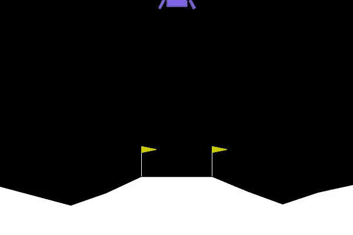

</img>

*90 generation - neat pop 100*

## neat (wip)

Explorations into NEAT and some of its derivative research

## quick test

```bash
$ sh install.sh
```

Then

```bash
$ pip install '.[gym]' && python train_lunar.py
```

## citations

```bibtex
@article{Stanley2011CompetitiveCT,
    title   = {Competitive Coevolution through Evolutionary Complexification},
    author  = {Kenneth O. Stanley and Risto Miikkulainen},
    journal = {ArXiv},
    year    = {2011},
    volume  = {abs/1107.0037},
    url     = {https://api.semanticscholar.org/CorpusID:11881625}
}
```

```bibtex
@inproceedings{4665912,
    author  = {Miguel, Cesar Gomes and Silva, Carolina Feher da and Netto, Marcio Lobo},
    booktitle = {2008 10th Brazilian Symposium on Neural Networks},
    title   = {Structural and Parametric Evolution of Continuous-Time Recurrent Neural Networks},
    year    = {2008},
    doi     = {10.1109/SBRN.2008.12}
}
```

```bibtex
@article{Khamesian2021HybridSN,
    title   = {Hybrid self-attention NEAT: a novel evolutionary self-attention approach to improve the NEAT algorithm in high dimensional inputs},
    author  = {Saman Khamesian and Hamed Malek},
    journal = {Evolving Systems},
    year    = {2021},
    pages   = {1-15},
    url     = {https://api.semanticscholar.org/CorpusID:244920723}
}
```

```bibtex
@article{stanley:ec02,
    title   = {Evolving Neural Networks Through Augmenting Topologies},
    author  = {Kenneth O. Stanley and Risto Miikkulainen},
    volume  = {10},
    journal = {Evolutionary Computation},
    number  = {2},
    pages   = {99-127},
    url     = "http://nn.cs.utexas.edu/?stanley:ec02",
    year    = {2002}
}
```
